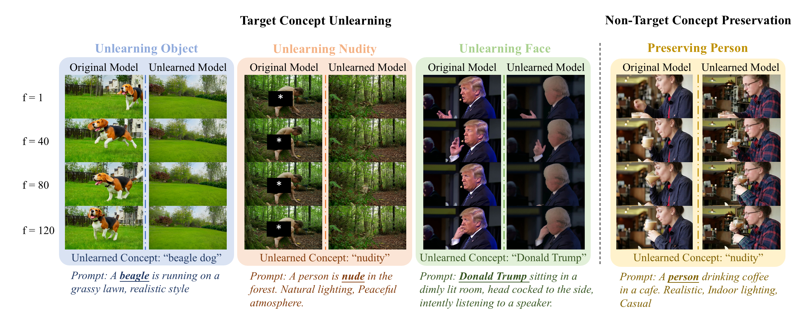

# T2VUnlearning

This is the official code for T2VUnlearning: A Concept Erasing Method for Text-to-Video Diffusion Models.



**We propose T2VUnlearning, a robust and precise unlearning method for T2V models.** T2VUnlearning effectively prevents the generation of videos containing target concepts while preserving the model's knowledge of non-target concepts.

## TODO

- [x] Model checkpoint
- [x] Inference code
- [ ] Training code

## Installation

1. **Create a Conda environment with Python 3.10:**

```bash
conda create -n eraser python=3.10
conda activate eraser
```

2. **Install the required dependencies:**

Install specific versions of `torch`, `transformers`, and `accelerate` to ensure reproducibility. While other versions may work (as long as they are compatible with `diffusers`), we recommend using the versions below:

```bash
pip install torch==2.6.0 transformers==4.48.0 accelerate==1.1.0
```

3. **Install `diffusers` from source:**

We use `diffusers==0.33.0.dev0`. Please install it with the provided source file.

```bash
cd diffusers
pip install -e .
cd examples/cogvideo
pip install -r requirements.txt
pip install opencv-python omegaconf imageio imageio-ffmpeg
```

## Inference

First, download the weights of the nudity erasure adapters via [Google Drive](https://drive.google.com/drive/folders/11r1dS2vzmbFeJZeDVZGsb2z9Tkrx64I1?usp=sharing).

We provide the inference scripts for T2VUnlearning. For CogVideoX-2B and 5B, please use the `test_cogvideo.sh`. 

```
CUDA_VISIBLE_DEVICES=0 python test_cogvideo.py \
--prompt=[Test prompt] \
--model_path=[Path of pretrained CogVideoX diffusers weight] \
--eraser_path=[Path of nudity erasure adapter] \
--eraser_rank=128 \
--num_frames=[Number of frames to generate. Default 49] \
--generate_clean \
--output_path=[Prefix for output videos] \
--seed=42
```

After running the script, you should find two output videos: `[output_path]_clean.mp4` and `[output_path]_erased.mp4`, corresponding to the results from the original model and the unlearned model, respectively.

For HunyuanVideo, please use the `test_hunyuanvideo.sh`

```
CUDA_VISIBLE_DEVICES=0 python test_hunyuan.py \
--prompt=[Test prompt] \
--model_path=[Path of pretrained HunyuanVideo diffusers weight] \
--eraser_path=[Path of nudity erasure adapter] \
--eraser_rank=128 \
--num_frames=[Number of frames to generate. Default 49] \
--generate_clean \
--output_path=[Prefix for output videos] \
--seed=42
```

We also include inference script of SAFREE (`test_safree_hunyuan.sh`)and negative prompting (`test_neg_hunyuan.sh`) for HunyuanVideo.

Evaluation prompt datasets can be found in `evaluation/data`.

## Acknowledgements

This repository is built upon the excellent work of the following projects:

- [Receler](https://github.com/jasper0314-huang/Receler)
- [finetrainers](https://github.com/a-r-r-o-w/finetrainers)
- [diffusers](https://github.com/huggingface/diffusers)

We sincerely thank the authors and contributors of these projects for their valuable tools, insights, and open-source efforts. 